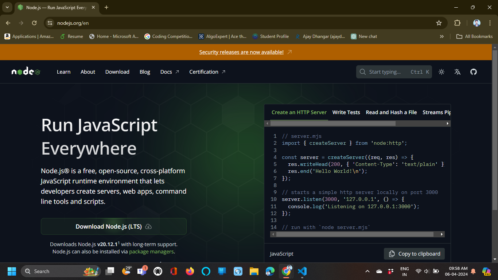
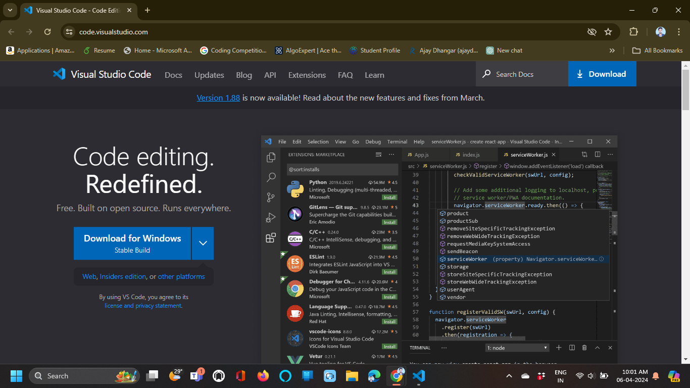
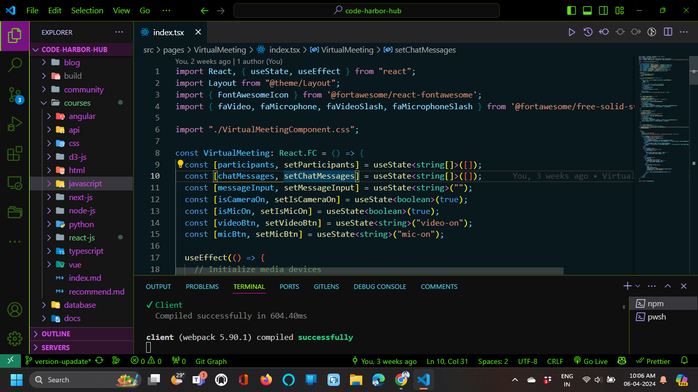

In this lesson, we will learn how to set up your development environment for React development. We will cover the installation of Node.js, npm (Node Package Manager), and a code editor to get started with React development.

## Node.js

Node.js is a JavaScript runtime built on Chrome's V8 JavaScript engine. It allows you to run JavaScript code outside of a web browser, making it ideal for server-side development, command-line tools, and building JavaScript applications.

To install Node.js, follow these steps:

1. Go to the [Node.js website](https://nodejs.org/) and download the LTS (Long-Term Support) version for your operating system.
    
   [](https://nodejs.org/en)

2. Run the installer and follow the installation instructions.
3. Verify the installation by opening a terminal or command prompt and running the following commands:

```bash title="Check Node.js version"
node -v
```

```bash title="Check npm version"
npm -v
```

If you see the version numbers for Node.js and npm, the installation was successful.

## npm (Node Package Manager)

npm is the default package manager for Node.js and JavaScript. It allows you to install, manage, and share packages of code with other developers. You can use npm to install libraries, frameworks, tools, and dependencies for your projects.

To install npm, follow these steps:

1. npm is included with Node.js, so you don't need to install it separately.
2. Verify the installation by opening a terminal or command prompt and running the following command:

```bash title="Check npm version"
npm -v
```

If you see the version number for npm, the installation was successful.

## Code editor

A code editor is a tool used by developers to write, edit, and manage code for software development. There are many code editors available, but some popular choices for React development include:

- [Visual Studio Code](https://code.visualstudio.com/) 🚀
- [Atom](https://atom.io/)
- [Sublime Text](https://www.sublimetext.com/)
- [WebStorm](https://www.jetbrains.com/webstorm/)
- [Vim](https://www.vim.org/)
- [Emacs](https://www.gnu.org/software/emacs/)

Choose a code editor that you are comfortable with and that meets your development needs. Visual Studio Code is a popular choice among developers due to its features, extensions, and community support.

:::note 📝 Visual Studio Code (VS Code) Download / Installation

In this course, we will be using Visual Studio Code as our code editor. You can download it from the [Visual Studio Code website](https://code.visualstudio.com/).



1. Go to the [Visual Studio Code website](https://code.visualstudio.com/).
2. Download the installer for your operating system.
3. Run the installer and follow the installation instructions.
4. Open Visual Studio Code and install any recommended extensions for JavaScript and React development.
5. You are now ready to start coding with Visual Studio Code!
6. If you are using a different code editor, follow the installation instructions for that editor.
7. Make sure to install any recommended extensions for JavaScript and React development in your code editor.
8. You are now ready to start coding with your preferred code editor!
9. If you are using a different code editor, follow the installation instructions for that editor.

   

   Now that you have installed Node.js, npm, and a code editor, you are ready to start building React applications. You can use these tools to create, develop, and deploy React projects on your local machine.
:::

:::tip more 📌 Additional Resources

1. Our official vs code theme for Code Editor [Dark Code Master](https://marketplace.visualstudio.com/items?itemName=DarkCodeMaster.dark-code-master)
   
   <Tabs>
      <TabItem value="On Marketplace" label="On Marketplace">

        [](https://marketplace.visualstudio.com/items?itemName=DarkCodeMaster.dark-code-master&ssr=false#overview)

      </TabItem>
      <TabItem value="On Github" label="On Github">

         [](https://github.com/Ajay-Dhangar/dark-code-master-theme)

      </TabItem>

      <TabItem value="On Vs Code" label="On Vs Code">

         [](vscode:extension/DarkCodeMaster.dark-code-master)

      </TabItem>
   </Tabs>   

2. [Visual Studio Code Tips and Tricks](https://code.visualstudio.com/docs/getstarted/tips-and-tricks)

3. [Visual Studio Code Keyboard Shortcuts](https://code.visualstudio.com/shortcuts/keyboard-shortcuts-windows.pdf)

4. [Visual Studio Code Extensions for JavaScript and React Development](https://code.visualstudio.com/docs/nodejs/reactjs-tutorial)

5. [Visual Studio Code Marketplace](https://marketplace.visualstudio.com/)

:::


## Now run your first JavaScript code using Node.js

Create a new file named `hello.js` and add the following code:

```javascript title="hello.js"
console.log('Hello, Node.js!');
```

Save the file and open a terminal or command prompt in the same directory. Run the following command to execute the JavaScript code using Node.js:

```bash
node hello.js
```

You should see the output `Hello, Node.js!` displayed in the terminal. Congratulations! You have successfully run your first JavaScript code using Node.js.

## Conclusion

In this lesson, we learned how to set up our development environment for React development by installing Node.js, npm, and a code editor. We also ran our first JavaScript code using Node.js to verify the installation. Setting up your development environment is the first step towards building React applications, and it is essential to have the right tools and environment to work efficiently.